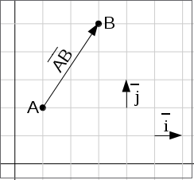
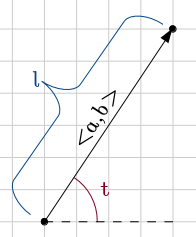

# Math for Programmers

This tutorial goes **really fast**. I'll explain things more peacefully
if someone has trouble following it.

## Functions

Here's a typical function definition in math:

![math:f(x)=2x][]

![math:f(6)=12][]

There is no special syntax for defining a function. All we have is the
equal sign, and when defining a function we just say that its value at x is
equal to something.

If you're familiar with a functional programming language like Haskell, then
you'll probably realize that the above math looks a lot like this Haskell
session:

```haskell
Prelude> let f x = 2*x
Prelude> f 6
12
Prelude>
```

If you're feeling like WTF is this, here's a Python session that should make
everything clear.

```python
>>> def f(x):
...     return 2*x
...
>>> f(6)
12
>>>
```

Quick note about `f(x)` versus `f x`: if you define your own function called
![math:f][] or ![math:g][] you should use parentheses, but you may omit them
with some "special" functions like ![math:\sin][] and ![math:\cos][] for
historical reasons.

Also note that mathematicians prefer single-letter variable names because math
was originally written on paper, and writing long things by hand sucks. Again,
this doesn't apply to the "special" functions.

## Very basic trigonometry (aka trig)

**Problem:** A player moves to top-right at the angle of 60° measured from the
x axis at 10 pixels per second. How many pixels should the player's x and y
change every second?

```
            y
            |      O     <-- the player
            |     /
            |    /
            |   / ) 60°
------------|--/-----------> x
            | /
            |
```

Note that the y axis goes up in math so higher means bigger, but in programming
it's usually upside down.

Our problem has something to do with sine and cosine. The unit circle is a
circle with radius 1 placed in the middle of the xy plane. Here's a picture that
shows what sine and cosine are:


This is really quite simple: the x coordinate is ![math:\cos t][] and the y
coordinate is ![math:\sin t][]. But the radius of the unit circle is 1 instead
of our 10, so we need to multiply everything by 10 to scale it up. We get this:

```python
player.x += 10*cos(60)
player.y += 10*sin(60)
```

Based on the unit circle, ![math:\sin 60\degree][] should be somewhere between
0.5 and 1 since the height of the x axis is 0 and the circle's top is at 1 (the
radius is 1). But if we try this out in Python, something is wrong:

```python
>>> import math
>>> math.sin(60)
-0.3048106211022167
>>>
```

Now you're feeling really WTF. The angles with negative sines should be below
the x axis, e.g. something between 180° and 360°.

The problem is that Python, Haskell, C and most other programming languages use
radians by default instead of degrees. Let's convert 60° to radians so the sine
function is happy:

```python
>>> math.sin(math.radians(60))
0.8660254037844386
>>> math.cos(math.radians(60))
0.5000000000000001
>>> 
```

That's more like it. `0.5000000000000001` is obviously not an accurate result,
but it's good enough for a programmer while a mathematician would say that
![math:\sin 60\degree = {\sqrt 3 \over 2}][] and
![math:\cos 60\degree = {1 \over 2}][]. I might write more about radians, how
the heck I came up with those mathy-accurate values and how Python's conversion
functions work some day.

This tutorial uses the degree sign ° when you may need to convert things
between radians and degrees.

## Vectors

A point is simply a pair of x and y coordinates, and a vector represents the
difference between two points. For example, if we have the points
![math:A=(1,2)][] and ![math:B=(3,5)][], the vector from A to B is
![math:\overline{AB}=2\overline{i}+3\overline{j}][]. Here
![math:\overline{i}][] and ![math:\overline{j}][] are vectors that go right and
up by 1 unit, respectively.



A vector like ![math:2\overline{i}+3\overline{j}][] can be also written as
![math:<2,3>][]. Use whatever style you like.

We could also have used vectors in the above trig example. The advantage with
them is that moving the player is really simple:

```python
player.x += speed_vector.i
player.y += speed_vector.j
```

A disadvantage is that if we want to change the angle that the player moves at
by 1° we can't just do `moving_angle += 1`. Of course it's possible to change
that angle, but not as simple.

Another nice thing about vectors is that they can be +'ed together easily.
For example, if we first move 3 units to right, then 4 units to top and then
5 more units to right, our total movement is simply
![math:3\overline{i}+4\overline{j}+5\overline{i} = 8\overline{i}+4\overline{j}][].

Now let's look into handy calculations that can be done with vectors. If you
want to know why these things work like they work just tell me about it and
I'll write more explanations (but I'll put them to another file so they won't
disturb people who don't care about them, and add a link to that here).



![math:l = \sqrt{a^2+b^2}][]

![math:t = \text{atan2}(b,a)][]

Here atan2 is a function that mathematicians don't use, but I used it here
because most programming languages have it, it takes care of some corner cases
and it's sometimes more precise than doing the same thing with other functions.
In other words, use atan2 because it's good.

For example, if we move 1 unit to the right and 2 units up, our vector is
![math:<1,2>][], its length is ![math:\sqrt{1^2+2^2} = \sqrt5 \approx 2.24][]
and the angle is ![math:\text{atan2}(2,1) \approx 63.4\degree][].

You can also turn a length and an angle to a vector, but that turns out to be
much more complex than the stuff above so I won't show that here.

[math:f(x)=2x]: images/math/080320743c76f725cd1f62a2c774c4e6.gif
[math:f(6)=12]: images/math/152e1ca519e8fcf69c2dbda118348af2.gif
[math:f]: images/math/8fa14cdd754f91cc6554c9e71929cce7.gif
[math:g]: images/math/b2f5ff47436671b6e533d8dc3614845d.gif
[math:\sin]: images/math/5912fc1251cd0c1e212f6dd8d19f17ef.gif
[math:\cos]: images/math/8effff999de692c242b9f7a539c63e58.gif
[math:\cos t]: images/math/4d3eb39ad6e06c939af4dee7de899759.gif
[math:\sin t]: images/math/5732d78efedc927ac0d505b0b839d142.gif
[math:\sin 60\degree]: images/math/10eb7bf694bb1144845276b2337dd629.gif
[math:\sin 60\degree = {\sqrt 3 \over 2}]: images/math/2dbba55f17b7abb4642fb000b1e1eed1.gif
[math:\cos 60\degree = {1 \over 2}]: images/math/f594199d05540abcf86048e7381f7e2f.gif
[math:A=(1,2)]: images/math/ea55273b1ce070424fbe13c45d6270c9.gif
[math:B=(3,5)]: images/math/ef624b5778b8523126644acae2e90d0c.gif
[math:\overline{AB}=2\overline{i}+3\overline{j}]: images/math/1efdde526c4454c415962aee4c31c189.gif
[math:\overline{i}]: images/math/e7b06e56bc1bc0ddb7d4b18f610a22f1.gif
[math:\overline{j}]: images/math/522c83fef16bb027f2f74695a0da4f90.gif
[math:2\overline{i}+3\overline{j}]: images/math/e841e0cd2b87a7caab51341881b2179e.gif
[math:<2,3>]: images/math/477e582288e4243cb3dc9173beaf64fc.gif
[math:3\overline{i}+4\overline{j}+5\overline{i} = 8\overline{i}+4\overline{j}]: images/math/a6cc20a2be8c06d9ba7e53998fc8558c.gif
[math:l = \sqrt{a^2+b^2}]: images/math/d0991f3c2601c3ea485cd3956b3bc412.gif
[math:t = \text{atan2}(b,a)]: images/math/17e4437cf9d2ecd41e41ccc5648befa5.gif
[math:<1,2>]: images/math/10adba9a4d1293648444f90c1f98f4af.gif
[math:\sqrt{1^2+2^2} = \sqrt5 \approx 2.24]: images/math/b80cc910ea17ab398618758290d4b592.gif
[math:\text{atan2}(2,1) \approx 63.4\degree]: images/math/cd851b8b9812898e8b80194e2aa51dd2.gif
