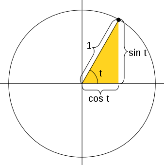
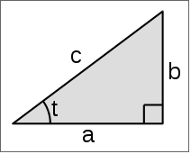
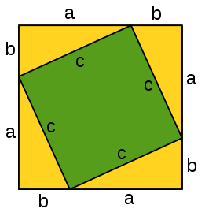

Proofs and Explanations
=======================

.. _geometry-explained:

I used a bunch of spooky formulas in this tutorial. Some of them are
definitions of e.g. `\sin` or `\cos`, but in this chapter we'll focus on those
that aren't and prove that they actually work.

.. _unitcircle-triangle-compat:

Two ways to define sine and cosine
~~~~~~~~~~~~~~~~~~~~~~~~~~~~~~~~~~

In :ref:`the unit circle trig section <unitcircletrig>` we defined `\sin` and
`\cos` with a unit circle, but then in
:ref:`the triangle trig section <triangletrig>` we defined them with a
triangle. These definitions are compatible with each other. If we draw a
picture like this...

...and apply the triangle stuff to the angle `t`, we get this:

.. math:: \sin t = \frac{\sin t}{1}
.. math:: \cos t = \frac{\cos t}{1}
.. math:: \tan t = \frac{\sin t}{\cos t}

The first two formulas are obviously true with any `t`, but the last one is a
bit more interesting. Actually we found another way to define `\tan`, and it
also works with a triangle:

.. math::
   \frac{\sin t}{\cos t} = \frac{b/c}{a/c}
   = \frac{b \cdot \frac 1 c}{a \cdot \frac 1 c} = \frac b a = \tan t

.. _pythagoras-proof:

Pythagorean Theorem
~~~~~~~~~~~~~~~~~~~

This is a well-known proof and I like it because it's simple.

We can calculate the total area of the above square in a couple different ways:

- The square's sides are each `a+b`, so the area must be
  `(a+b)(a+b) = a(a+b) + b(a+b) = aa+ab+ba+bb = a^2 + 2ab + b^2`.
- The square consists of the green square whose area is `c^2` and 4 yellow
  triangles with area `\frac{ab}{2}` each. Total area is
  `c^2 + 4 \frac{ab}{2} = c^2 + \frac{4}{2}ab = c^2 + 2ab`.

We must get the same area with both ways, so we get this
:ref:`equation <equations>`:

.. math:: (a+b)(a+b) = c^2 + 4\frac{ab}{2}
.. math:: a^2 + 2ab + b^2 = c^2 + 2ab
.. math:: a^2 + b^2 = c^2
