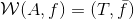

lel ![f'(x)=\frac{dy}{dx}=\frac{f(x+dx)-f(x)}{dx}=\lim_{h\rightarrow\infty}\frac{f(x+h)-f(x)}{h}][] like

[f'(x)=\frac{dy}{dx}=\frac{f(x+dx)-f(x)}{dx}=\lim_{h\rightarrow\infty}\frac{f(x+h)-f(x)}{h}]: wat.gif
