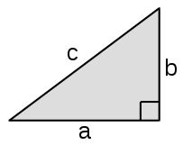
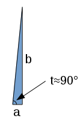

Vector Explanations
===================

.. _vectors-explained:

If you haven't read `this vector section <README.md#vectors>`_ yet go ahead and
read it now. This chapter explains how the things I showed in the vector section
work.

The length
~~~~~~~~~~

In the vector section I said that the length of a vector `<a,b>` is
`\sqrt{a^2 + b^2}`. If we have a square with triangles in it like this...

.. image:: https://www.mathsisfun.com/geometry/images/pythagorean-theorem-proof.png

...then we can calculate its area in a couple different ways:

   - The square's sides are each `a+b`, so the area must be
     `(a+b)(a+b) = a(a+b) + b(a+b) = a^2+ab+ba+b^2 = a^2+2ab+b^2`.
   - The square consists of the yellow square whose area is `c^2` and 4 blue
     triangles with area `\frac{ab}{2}` each.

We must get the same area with both ways, so we get this:

.. math:: (a+b)(a+b) = c^2 + 4\frac{ab}{2}
.. math:: a^2+2ab+b^2 = c^2+2ab
.. math:: a^2 + b^2 = c^2
.. math:: \sqrt{a^2+b^2} = c

If you look carefully you notice that the last step assumes `c \ge 0`.
This is no problem because a triangle with a negative side length doesn't make
much sense anyway.

This is not limited to vectors in any way; you can easily calculate the longest
side of any triangle with a 90° angle like this. "Hypotenuse" is a fancy name
for the longest side of such triangle, and that's why the `\sqrt{a^2+b^2}`
function is named hypot.

The atan2
~~~~~~~~~

Now you should know how `\sin` and `\cos` can be defined in the
unit circle. There's also another, perhaps more common way to define them using
a triangle with one 90° corner.

This triangle is compatible with the `a^2+b^2=c^2` thing, but we can
also define sine, cosine and tangent in it like this:

`\sin t = \frac a c`

`\cos t = \frac b c`

`\tan t = \frac a b`

It's also possible to define `\tan t` with the unit circle, but it's not
as simple as sine and cosine so we skipped that.

These triangle definitions are perfectly compatible with the unit circle
equivalents. If you draw `a triangle like this <images/unitcircle-triangle.png>`_
into the unit circle and then apply the triangle stuff, you get things like
`\sin t = \frac{\sin t}{1}`.

Let's look at the vector image again:

.. image:: images/vector-calc.png

Now with the tangent stuff we get this:

`\tan t = \frac b a`

`t = \arctan \frac b a`

Here `\arctan` is the inverse of `\tan`, so
`\arctan (\tan t) = t`. Most programming languages have an ``atan(x)``
function that returns `\arctan x`, and ``atan2(b,a)`` simply calculates
`\arctan \frac b a`.

Note that if `a=0` then `\frac b a` is dividing by 0 and thus
not defined, but if `a` is really really close to 0 then `t`
is about 90°.

That's why ``atan2(1, 0)`` returns 90° and ``atan2(-1, 0)`` returns -90°. The
negativeness shouldn't be a problem because negative angles behave correctly
with functions like `\sin`, `\cos` and `\tan`.
